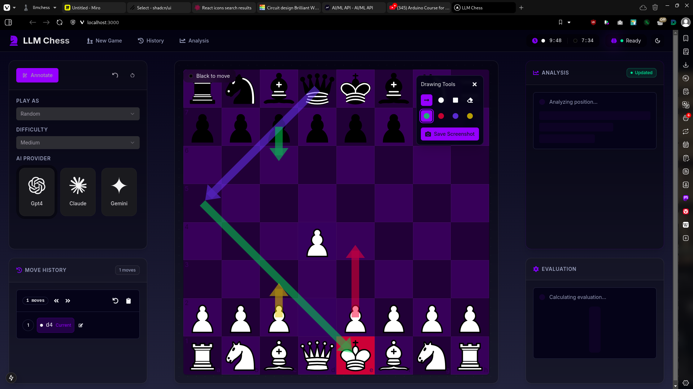

# LLM Chess

Welcome to LLM Chess! 👋 This is a project that brings together the fascinating worlds of chess and artificial intelligence. I've created an interactive chess interface where you can challenge and learn from AI language models, watching their thought process unfold in real-time.



## ✨ Features

- 🎮 Challenge powerful AI models at chess (currently supporting GPT-4, Claude, and Gemini)
- 🧠 Get real-time position analysis and move evaluations
- 💭 Peek into the AI's mind - see its strategic thinking and planning
- 🎨 Modern, clean UI with light/dark mode support
- ⚡ Lightning-fast performance with Next.js 14
- 📱 Fully responsive design - play on any device (is what i would like to say, but it's not working yet)

## 🚀 Getting Started

1. First, grab the code:

   ```bash
   git clone https://github.com/Felixdiamond/llmchess.git
   cd llmchess
   ```

2. Install the dependencies:
   As for me i prefer the superior bun :)

```bash
bun i
```

But you can also use npm, yarn, or pnpm if you prefer.

```bash
npm install
# or
yarn install
# or
pnpm install
```

3. Set up your environment:

   ```bash
   cp .env.example .env
   ```

   You'll need to add your API keys to the `.env` file, check their docs for that, i'm not writing it here.
4. Fire up the development server:
   Again, superior bun :)
   ```bash
   bun dev
   ```
   Or this:
   ```bash
   npm run dev
   # or
   yarn dev
   # or
   pnpm dev
   ```

5. Visit [http://localhost:3000](http://localhost:3000) and start playing!

## 🛠️ Current Status

The project is actively under development, and I'm continuously working to improve it. Currently, I'm facing a limitation with the only API key i had, Gemini API (my quota ran out 😅), so I haven't been able to fully test ANY of the integration. So there will definitely be bugs, help me find them!

- 🐛 Open an issue on GitHub
- 📧 Drop me a line at diamondfelix006@gmail.com
- 🤝 Feel free to contribute (see below)

## 🔧 Tech Stack

This project is built with modern technologies I love:

- ⚡ [Next.js 14](https://nextjs.org/) - For blazing-fast performance
- 📘 [TypeScript](https://www.typescriptlang.org/) - For type safety
- 🎨 [Tailwind CSS](https://tailwindcss.com/) - For beautiful styling
- 🎬 [Framer Motion](https://www.framer.com/motion/) - For smooth animations
- ♟️ [chess.js](https://github.com/jhlywa/chess.js) - For chess logic
- 🤖 [OpenAI API](https://platform.openai.com) - For GPT-4 integration
- 🧠 [Google AI API](https://ai.google.dev/) - For Gemini integration
- 🤖 [Anthropic API](https://docs.anthropic.com/) - For Claude integration

## 🤝 Contributing

I'd love your help making LLM Chess even better! Here's how you can contribute:

1. Fork the repository
2. Create your feature branch (`git checkout -b feature/AmazingFeature`)
3. Commit your changes (`git commit -m 'Add some AmazingFeature'`)
4. Push to the branch (`git push origin feature/AmazingFeature`)
5. Open a Pull Request

## 📄 License

This project is licensed under the MIT License - see the [LICENSE](LICENSE) file for details.

---

Built with ❤️ by a chess enthusiast who loves AI. Star ⭐ the repo if you find it interesting! and contributee by finding bugs or just flat out fixing them.
